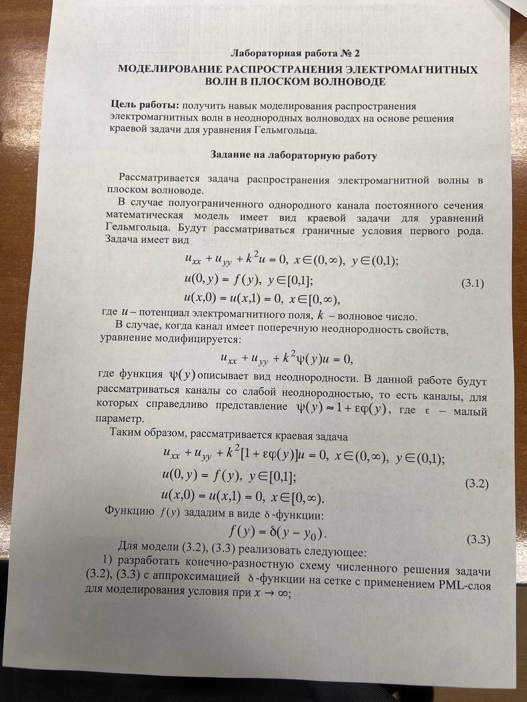
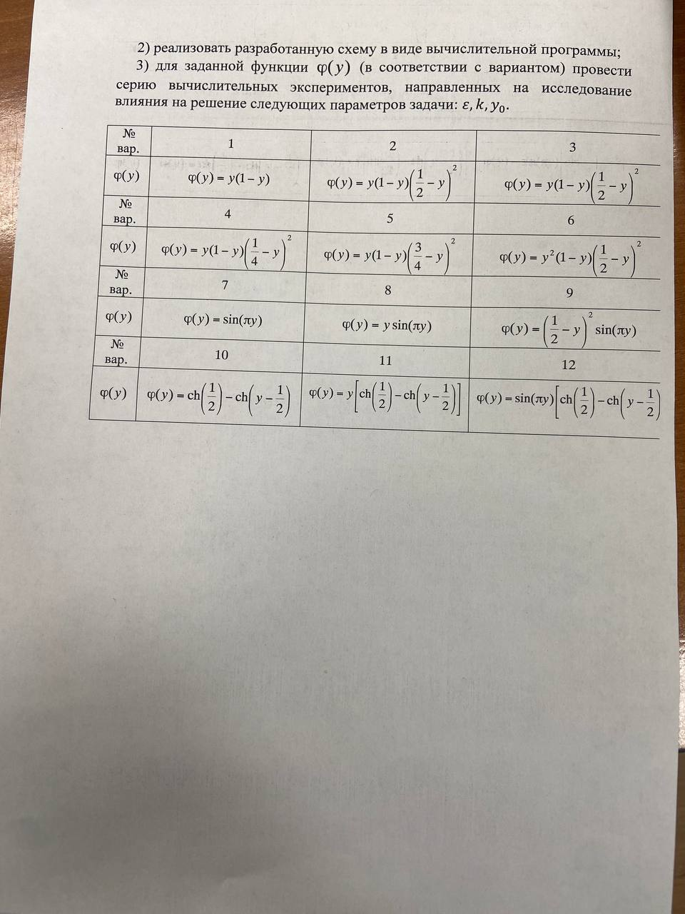

Зависимости
-------
1. ## Eigen
    ```bash
    cd lab3
    git clone https://gitlab.com/libeigen/eigen.git
   ```
## Информация для сдающих
Реализована две библиотеки. 
- Первая  код Рустема вроде бодрый вариант, но работает долго пипец и не сильно проработы границы, в общем для ознакомления подойдет.
- Второй код Вадима, вроде супер и работает быстро


Задания
------

